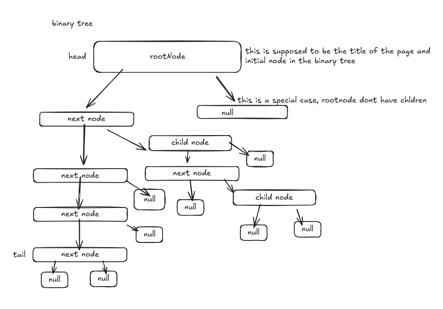
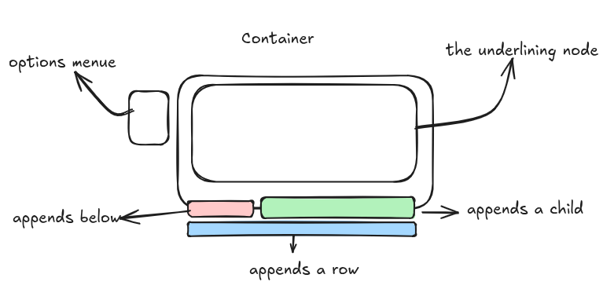
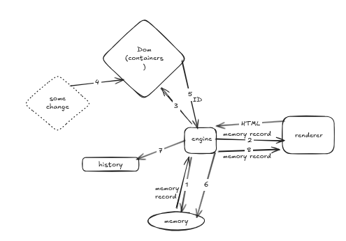

# This is How the App Works, Follow Me Step by Step

## Format

- The format is just a Markdown file.
- Also, it is only row-based, so no columns are there.

## Entities

An entity is the representation of a block. The following is the interface of the entity:

In editor mode, the rendering of the entity provides extra features for editing itself. This is because editing is in preview. This might hurt architecture cleanliness and cause circular dependencies, but this is the best option so far.

```ts
export interface BlockEntityInterface<
    DataType = string,
    OptionsType = Record<string, unknown>,
> {
    get CONVERTIBLE(): boolean;

    get TYPE(): BlockTypesEnum;
    set TYPE(type: BlockTypesEnum);

    get DATA(): DataType;
    set DATA(data: DataType);

    get OPTIONS(): OptionsType;
    set OPTIONS(options: OptionsType);

    get HTML_ELEMENT(): HTMLElement;
}
```

Block entities inherit from a shared abstract class that implements the basic contract and enforces convertibility rules. Non-convertible types are: VIDEO, AUDIO, HR, IMAGE, and EMBEDDING.

Also, block types are represented in [[./All-Features.md]]. They have the following class names in the DOM:

```ts
export enum BlockTypesEnum {
    H1 = "H1",
    H2 = "H2",
    H3 = "H3",
    H4 = "H4",
    H5 = "H5",
    H6 = "H6",
    PARAGRAPH = "PARAGRAPH",
    CHECKBOX = "CHECKBOX",
    QUOTE = "QUOTE",
    CALLOUT = "CALLOUT",
    HR = "HR",
    LIST = "LIST",
    TOGGLE = "TOGGLE",
    TABLE = "TABLE",
    CODE_BLOCK = "CODE_BLOCK",
    IMAGE = "IMAGE",
    VIDEO = "VIDEO",
    AUDIO = "AUDIO",
    HTML = "HTML",
    EMBEDDING = "EMBEDDING",
    LATEX = "LATEX",
}
```

All class names are defined in `src/constants/DocumentClassNames.constant.ts` and include:

```ts
H1 = "H1",
H2 = "H2",
H3 = "H3",
H4 = "H4",
H5 = "H5",
H6 = "H6",
PARAGRAPH = "PARAGRAPH",
CHECKBOX = "CHECKBOX",
QUOTE = "QUOTE",
CALLOUT = "CALLOUT",
HR = "HR",
LIST = "LIST",
TOGGLE = "TOGGLE",
TABLE = "TABLE",
CODE_BLOCK = "CODE_BLOCK",
IMAGE = "IMAGE",
VIDEO = "VIDEO",
AUDIO = "AUDIO",
HTML = "HTML",
EMBEDDING = "EMBEDDING",
LATEX = "LATEX",
ABBREVIATIONS = "ABBREVIATIONS",
ADDRESS = "ADDRESS",
BUTTON = "BUTTON",
KEYBOARD_BUTTONS = "KEYBOARD_BUTTONS",
HYPERLINKS = "HYPERLINKS",
PROGRESS_BAR = "PROGRESS_BAR",
HIGHLIGHT = "HIGHLIGHT",
BOLD = "BOLD",
ITALIC = "ITALIC",
STRIKE_THROUGH = "STRIKE_THROUGH",
UNDERLINE = "UNDERLINE",
INLINE_LATEX = "INLINE_LATEX",
```

Every inline effect has a class name.

## Nodes

Nodes are the representation of Entities in memory. They have child-parent and below-above relationships. They are also the gateway to accessing entities.

```ts
/**
 * This represents the entity in memory and the editor interface as a node in a binary tree
 */
export interface NodeInterface extends BlockEntityInterface {
    get CONVERTIBLE(): boolean;

    get ENTITY(): BlockEntityInterface;

    get TYPE(): BlockTypesEnum;
    set TYPE(type: BlockTypesEnum);

    get ID(): number;
    set ID(id: number);

    get DATA(): string;
    set DATA(data: string);

    get HTML_ELEMENT(): HTMLElement;

    get parentNodeID(): number | null;
    set parentNodeID(id: number | null);

    get leftNodeID(): number | null;
    set leftNodeID(id: number | null);

    get rightNodeID(): number | null;
    set rightNodeID(id: number | null);
}
```

## Memory

Memory is where nodes are present. In the app's lifetime, there is only one memory manager singleton, which holds an array-based memory store. That store does all the heavy work and stores all nodes in `ArrayRepresentation` for the binary tree.

Example:


```ts
/**
 * The architecture is a simple binary tree.
 * The left node is the next block.
 * The right node is the nested block.
 * If there is no nested block, the right node is null.
 */

// A record of blocks using Binary Tree structure
export interface MemoryInterface {
    /**
     * Array of nodes (null slots are deleted nodes)
     */
    get ArrayRepresentation(): NodeInterface[];

    /**
     * Root level HEAD node ID
     */
    get HEAD_NODE_ID(): number | null;
    /**
     * Root level TAIL node ID
     */
    get TAIL_NODE_ID(): number | null;

    getNodeByID(nodeID: number): NodeInterface | null;

    deleteNode(nodeID: number): MemoryInterface;
    deleteMultipleNodes(nodeIDs: number[]): MemoryInterface;

    appendNode(node: NodeInterface): MemoryInterface;
    insertNodeBelow(node: NodeInterface, targetNodeID: number): MemoryInterface;
    insertMultipleNodesBelow(
        nodes: NodeInterface[],
        targetNodeID: number,
    ): MemoryInterface;

    moveNodeBelow(nodeID: number, targetNodeID: number): MemoryInterface;
    moveMultipleNodesBelow(
        nodeIDs: number[],
        targetNodeID: number,
    ): MemoryInterface;

    insertChildNode(node: NodeInterface, targetNodeID: number): MemoryInterface;
    appendChildNode(parentNodeID: number, childNodeID: number): MemoryInterface;
    appendMultipleChildNodes(
        parentNodeID: number,
        childNodeIDs: number[],
    ): MemoryInterface;

    duplicateNode(nodeID: number): MemoryInterface;
    duplicateMultipleNodes(nodeIDs: number[]): MemoryInterface;

    clearMemory(): MemoryInterface;
    exportMemory(): string;
}
```

The `ArrayRepresentation` is how we can store and rebuild the document again.

The rules are simple:

- The first item in the array is the root node.
- Deleted nodes leave null slots that can be reused by new nodes.

About `exportMemory`, it exports the array representation in the form of node snapshots (ID, TYPE, DATA, OPTIONS), plus head/tail IDs. This is for portability.

## Container

Containers are what the **_Renderer_** gives us on the screen. They are wrappers over the nodes.



## Putting It All Together

This is how it should work so far:



## History

The History system manages undo/redo functionality using a simple stack-based architecture.

### Architecture

The new implementation uses a straightforward approach:

```ts
/**
 * Stack of memory snapshots, where each snapshot is an array of nodes
 */
private _stack: NodeInterface[][];

/**
 * Current position in history (0-based index into _stack)
 * Points to the current state in the stack
 */
private _currentIndex: number;
```

### How It Works

The history system maintains a stack of complete memory snapshots:

1. **Stack Structure**: Each entry in `_stack` is a complete snapshot of all nodes at a specific point in time
2. **Current Index**: `_currentIndex` points to the current state in the stack
3. **Navigation**: Undo/redo operations simply move the index backward or forward

### Operations

#### do(nodes: NodeInterface[])

- Adds a new snapshot to the stack
- If in the middle of history (after undo), clears forward history
- Increments current index

#### undo()

- Decrements the current index (if not at beginning)
- Returns nodes at the new current position

#### redo()

- Increments the current index (if not at end)
- Returns nodes at the new current position

### Memory Model

```
_stack:  [[], [node1], [node1, node2], [node1, node2, node3]]
           ↑                                      ↑
      index 0                               index 3 (current)

BACKWARD_LENGTH = 3  (can undo 3 times)
FORWARD_LENGTH = 0   (cannot redo)
```

After undo twice:

```
_stack:  [[], [node1], [node1, node2], [node1, node2, node3]]
           ↑       ↑
      index 0  index 1 (current)

BACKWARD_LENGTH = 1  (can undo 1 time)
FORWARD_LENGTH = 2   (can redo 2 times)
```

### Key Features

- **Simplicity**: Single stack structure, no complex mappings
- **Complete Snapshots**: Each state is a full snapshot of memory
- **Efficient Navigation**: O(1) undo/redo operations (just index manipulation)
- **Branching**: When doing after undo, forward history is automatically cleared
- **Export**: Full history can be exported as JSON for persistence
