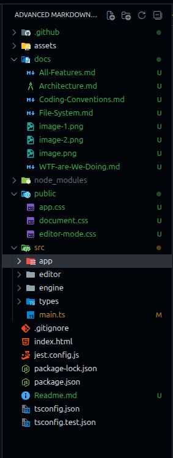

# File System

There is no magic here.

## Folder Structure



```yaml
.
├── assets # All required assets by the app
├── docs # We are here
│   ├── All-Features.md
│   ├── Architecture.md
│   ├── Coding-Conventions.md
│   ├── File-System.md
│   └── WTF-are-We-Doing.md
├── node_modules
├── public
│   ├── app.css # The styling of the application itself that contains the editor
│   ├── document.css # The styling of the entities and the rendered output of the preview
│   └── editor-mode.css # The document.css but with some extra details to support rendering of editing features of block entities
├── src
│   ├── app # The application that contains the editor
│   ├── constants # Shared constants (DOM class names, etc.)
│   ├── editor # The editor where all the UI is
│   ├── engine # Here all the heavy logic
│   │   ├── elements-store
│   │   ├── entities-store
│   │   ├── history
│   │   ├── memory
│   │   └── renderer
│   ├── types # All types, interfaces, and abstracts
│   └── main.ts # The entry point
```

- Also, folders like `lib` are used for assistance. Every class has its own folder with the file of that class, and a folder called `lib`.

- Every file has a file next to it called `<original file's name>.spec.ts`.

- Every folder has a `<foldername>.txt` file that explains what this folder is about and what to expect.

## Naming Conventions

- Folder names use `-` as separator, example: `some-folder-there`.

- File names start with name, pattern, and exported types, example: `something.factory.interface.ts`.

- If the export is a class, then capitalize the first letter, example: `Something.singleton.ts`.

- If the file is a helper (a helper is a file that exports a function that assists another code), add `.helper` at the end of its name, example: `something.helper.ts`.

- If the file has a utility function that is used globally by the app, then its file name should end with `.util`, example: `something.util.ts`. This means it is a utility function.
